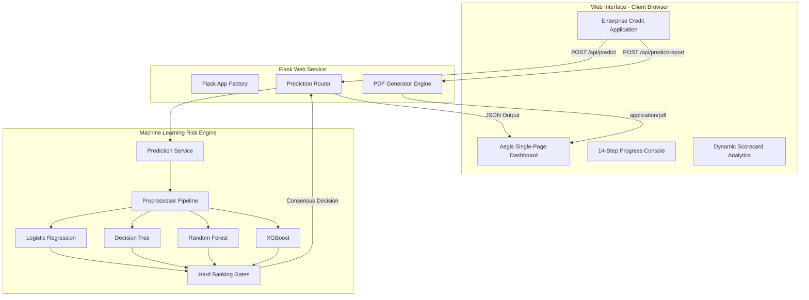

# Aegis Underwrite: Enterprise AI Credit Underwriting Platform

Aegis Underwrite is a production-grade, internal banking credit evaluation and risk assessment platform. It evaluates applicant creditworthiness by executing stratified machine learning models in parallel, running policy rule override gates, and generating comprehensive underwriting portfolios—without reporting credit bureau inquiries.


---

## 🏛️ Platform Architecture



---

## ✨ Features

* **Simplified Enterprise Application Form**: Multi-section credit application grouped into 5 logical blocks: Personal Info, Employment, Income & Assets, Credit Profile, and Liabilities. Includes prefilled defaults for easy evaluation testing.
* **14-Step Decision Pipeline Console**: Real-time spinner checks simulating institutional verification stages (cleaning, scaling, running model arrays, evaluating risk limits).
* **Multi-Model Scorecard Voting**: Computes inference results across 4 distinct models (Logistic Regression, Decision Tree, Random Forest, XGBoost) and displays a consensus card grid with latencies and model-specific logic explanations.
* **Hard Policy Overrides**: Hard-coded banking safety checks (e.g. credit score < 560, defaults = 'Yes', DTI > 55%) that veto model decisions to mimic real-world credit risk engines.
* **Dynamic Analytics & Empty States**: Starts with a clean initial placeholder stating *"No assessment has been performed"*. Upon submission, the scorecard table fades in rows, and the Feature Importance chart animates progress bars from `0%` to their relative weights.
* **Aegis Typography System**: Large scalable typography classes (e.g., Main Titles: `60px`, Sections: `32px`, Cards: `24px`, Labels: `16px`) built purely in CSS to enhance scannability and accessibility.
* **On-Demand PDF Generator**: Renders corporate-level multi-page PDF credit portfolios using ReportLab Platypus, incorporating dynamic page counts ("Page X of Y"), signature lines, and timestamping (using INR currency format).

---

## 📊 Model Performance Benchmarks

* **Winner Classifier**: **Random Forest** (stratified offline training, SMOTE oversampling applied).
* **Accuracy**: `97.80%`
* **Precision (High Risk)**: `31.65%`
* **Recall (High Risk)**: `22.32%`
* **F1-Score (High Risk)**: `26.18%`
* **Core Drivers**: Feature importance algorithms rank **Family Member Count**, **Age**, **Income**, and **Employment Length** as primary indicators of credit default.

---

## 📂 Project Structure

```
.
├── .github/
│   └── workflows/
│       └── ci.yml              # GitHub Actions CI pipeline
├── backend/
│   ├── config/
│   │   └── settings.py         # Application configuration classes
│   ├── routes/
│   │   ├── main.py             # Render and health check endpoints
│   │   └── prediction.py       # Prediction and PDF compiler routes
│   ├── services/
│   │   └── prediction_service.py # Core ML coordinator and banking logic
│   ├── static/
│   │   ├── css/
│   │   │   └── main.css        # Glassmorphic stylesheet & typography
│   │   └── js/
│   │       └── main.js         # Client-side controller and animations
│   ├── templates/
│   │   ├── 404.html            # Custom page not found error template
│   │   ├── 500.html            # Custom server error template
│   │   └── dashboard.html      # Enterprise single-page dashboard
│   ├── tests/
│   │   └── test_underwrite.py  # pytest-based integration test suite
│   ├── utils/
│   │   ├── logger.py           # Structured logger setup
│   │   ├── pdf_generator.py    # ReportLab multi-page PDF builder
│   │   └── validator.py        # Input data parser and validation schema
│   ├── __init__.py             # Package marker
│   └── app.py                  # Flask Application Factory
├── ml/
│   ├── models/                 # Pre-trained pipeline artifacts
│   │   ├── best_model.joblib   # Serialized Random Forest model
│   │   ├── decision_tree.joblib
│   │   ├── logistic_regression.joblib
│   │   ├── metrics.json        # Pre-calculated benchmarks
│   │   ├── preprocessor.joblib # ColumnTransformer pipeline
│   │   ├── random_forest.joblib
│   │   └── xgboost.joblib
│   ├── preprocess.py           # Feature transformations & mapping
│   ├── train.py                # Pipeline trainer
│   └── __init__.py
├── dataset/                    # Raw application CSV records
├── run_app.py                  # Flask production WSGI runner
├── Procfile                    # Render runtime start command
├── render.yaml                 # Render infrastructure configuration
├── runtime.txt                 # Render Python runtime environment
├── requirements.txt            # Dependency definitions
├── LICENSE                     # MIT License
└── README.md                   # System documentation
```

---

## 🚀 Installation & Local Run

### Prerequisites
* Python `3.10` or `3.11`
* Pip package manager

### 1. Clone & Setup Environment
```bash
git clone https://github.com/yourusername/Credit-card-approval-prediction-classification.git
cd Credit-card-approval-prediction-classification
python -m venv .venv
source .venv/bin/activate  # On Windows: .venv\Scripts\activate
```

### 2. Install Dependencies
```bash
pip install -r requirements.txt
```

### 3. Run Pipeline Checks (Optional)
If you wish to re-train the model artifacts locally:
```bash
python ml/train.py
```

### 4. Run the Unit Test Suite
Verify that all routing, endpoints, predictions, and PDF compiler functions are fully operational:
```bash
python backend/tests/test_underwrite.py
```

### 5. Launch local Flask server
```bash
python run_app.py
```
Open **[http://127.0.0.1:5000/](http://127.0.0.1:5000/)** in your browser to access the dashboard.

---

## ☁️ Render Deployment Guide

Aegis is pre-configured for seamless deployment to **Render** via web services.

### Environment variables
Set the following environment variables in your Render Dashboard:
* `FLASK_CONFIG`: `prod` (Loads production environment classes)
* `SECRET_KEY`: `your-custom-long-secret-key-string` (Disables fallback dev key)

### Render Settings
* **Build Command**: `pip install -r requirements.txt`
* **Start Command**: `gunicorn run_app:app`
* **Python Runtime**: `python-3.10.12`

---

## 📡 REST API Specifications

### 1. Health Status
* **Endpoint**: `/healthz` or `/api/health`
* **Method**: `GET`
* **Response**:
```json
{
  "environment": "prod",
  "ml_models_loaded": true,
  "status": "healthy"
}
```

### 2. Risk Assessment Inferences
* **Endpoint**: `/api/predict`
* **Method**: `POST`
* **Headers**: `Content-Type: application/json`
* **Payload**: Refer to **[test_underwrite.py](file:///C:/Users/HP/Desktop/CreditCardApproval/Credit-card-approval-prediction-classification/backend/tests/test_underwrite.py#L22)** for sample JSON models.
* **Response**:
```json
{
  "status": "success",
  "data": {
    "final_decision": "Approved",
    "risk_level": "Low",
    "confidence_score": 0.985,
    "risk_probability": 0.16,
    "reasons": [ ... ],
    "recommendations": [ ... ],
    "model_executions": [ ... ]
  }
}
```

---

## 🛡️ License

This project is licensed under the MIT License - see the [LICENSE](file:///C:/Users/HP/Desktop/CreditCardApproval/Credit-card-approval-prediction-classification/LICENSE) file for details.
